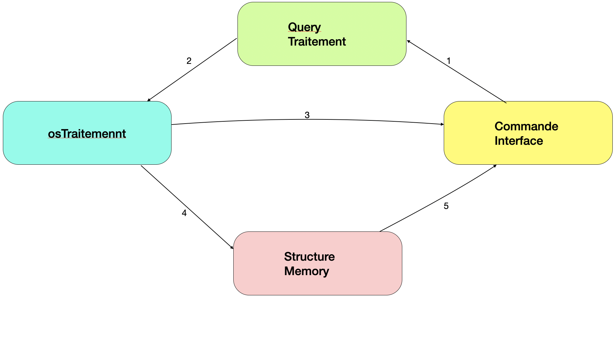

---
# Interface SQL pour un système de fichiers
---
## Sommaire

- [Introduction](#Introduction)
- [Documentation de l'usage de Calcite](#Documentation-de-l'usage-de-Calcite)
- [Architecture de l'application](#Architecture-de-l-'-application)
- [Exigences Fonctionnelles](#Exigences-Fonctionnelles)
- [Conclusion technique](#Conclusion-technique)
- [Conclusion](#Conclusion)
- [Manuel d’utilisation](#Manuel-d-’-utilisation)
- [Copyright and license](#copyright-and-license)
## Introduction

Apache Calcite est un framework open-source de traitement de requête, il possède la plupart des fonctionnalités d’un système de gestion de base de données et offre les fonctionnalités suivantes :

 
+ D'analyse, de validation et d’exécution de requêtes.
 
+ D'optimisation de requête. 
+ Des langages de requête comme le `SQL` standard, ou divers dialectes `SQL` et extensions. 

Cependant, Calcite n’offre pas les fonctionnalités de stockage et de gestion des données, et ne possède pas de base de données pour le stockage physique des données (i.e. les données traitées par Calcite ne sont pas conservées sur le disque comme elles le sont dans un SGBD classique).
  
Apache Calcite est soutenu par la fondation Apache Software (ASF). De plus, Apache Calcite est écrit en Java ce qui rend plus facile l’interopérabilité avec de nombreux autres systèmes de traitement des données open-source, eux-mêmes écrits en Java. 
 
D’ailleurs Calcite a été utilisé par de nombreuses plateformes de traitement de données open-source, pour lesquelles :
 
+ Calcite  fournit un support pour l’analyse et la validation de requêtes `SQL` pour les  systèmes de gestion de données qui n’en disposent pas.
+ Calcite offre différentes versions du langage `SQL` pour les systèmes de traitement de données qui ne possèdent pas de langage de requête.
+ Calcite offre un support  à la fois pour le traitement des données traditionnelles, et de données moins traditionnelles comme les données semi-structurées ou les données géospatiales... 
+ Calcite  fournit également un support d'optimisation de requêtes pour les systèmes qui ont déjà leur propre analyseur syntaxique et/ou leur propre langage de requête.

## Documentation de l'usage de Calcite

#### SqlParser
Dans cette partie nous allons apporter plus de précision sur les fonctionnalités de calcite, et leurs usages dans la réalisation de notre projet, cela passe par la présentation du module traitement requête (QueryTraitement). Dans un premier temps nous allons parler d’une des fonctionnalités les plus importantes d'apache calcite qui a permis de réaliser le module QueryTraitement, il s’agit du `SqlParser`. Le `SqlParser` a pour rôle de transformer une requête `SQL` en Arbre syntaxique abstrait, cela en s’appuyant sur Java cc un compilateur de compilateur qui comporte un générateur de parser, qui permet de créer un analyseur syntaxique.
L'AST construit par le parser et appelé `SqlNode`, mais, avant de parler plus en détaille de cet AST ‘le `SqlNode`' nous allons voir les fonctionnalités du Parser.
Afin de construire un parser calcite,  on a trois options différentes, trois méthodes create avec des paramètres d’entrée différents :
``` java
create(String sql, SqlParser.Config config);
create (Reader reader, SqlParser.Config config);
create (String s);
```
`SqlParser.Config` est une Class de calcite qui propose différentes configurations pour le Parser à créer, on peut par exemple modifier la sensibilité à la casse du parser ou bien la gestion des guillemets ou bien la taille maximale des identifiants.

La méthode `create(String Sql, SQLParser. Config config)` prend en paramètres une chaine de caractères qui représente la requête Sql et une configuration pour le parser.

La méthode `create (Reader reader, `SQL`Parser.Config config)` prend en paramètre un Reader du package [java.Io](https://docs.oracle.com/javase/7/docs/api/java/io/Reader.html)  et une configuration pour le parser.

Pour la réalisation de notre projet, la troisième méthode create convenait le mieux à nos besoins    `create (String s)` qui prend en paramètre la requête `SQL` à analyser.
Une fois le parser crée, plusieurs méthodes s’offrent à nous afin de transformer la chaine de caractères représentant une requête `SQL` donnée en entrée à la création du parser en un arbre appelé `SqlNode` et ces méthodes sont : 
``` java
parseExpression();
parseQuery();
parseQuery(String sql);
ParseStmt();
ParseStmtList();
```
La méthode `parseExpression()` a pour rôle d’analyser une expression `SQL` et construit l’ast qui en découle, quant au reste des méthodes elles analysent non pas des expressions `SQL` mais des instructions (ou statement). La différence avec une expression est qu’une instruction définit le contrôle des opérations de flux, de manipulation de données ou de définition de données. Une expression peut être évaluée et renvoie une seule valeur.

Dans le contexte de notre projet un exemple de statement serait une requête par exemple : 
```sql
SELECT nom  FROM Dossier WHERE taille = 16
```
Les noms de colonnes, les variables, les constantes, les fonctions d’agrégation sont toutes des expressions.

+ La méthode parseQuery( ) analyse des requêtes `SQL` `SELECT` et construit l’AST (`SqlNode`).
+ La méthode `parseQuery(String sql)` analyse des requêtes `SQL` `SELECT` donnés en entré et construit l’AST (`SqlNode`).
+ La méthode `ParseStmt()` analyse une requête `SQL` par forcément des requêtes `SELECT` et construit l’AST (`SqlNode`).
+ `ParseStmtList()` analyse un ensemble de requêtes données en paramètres lors de la création du parser et renvoie une liste d’est `SqlNodeList`, les requêtes doivent être séparées par un point-virgule.

Afin de répondre aux besoins de notre projet, nous nous sommes principalement appuyé sur la méthode `parseQuery()` étant donné que les requêtes `SELECT` représentent la très grande partie des requêtes `SQL` utile pour notre interface `SQL` pour un système de fichiers.

Jusqu’à présent nous avons parlé de ce que le `SqlParser` fait lorsque les requêtes sont valides,mais celles-ci ne le sont pas toujours, dans le cas échéant l’exception `SqlParseException` est levée lors de l’exécution de l’une des méthodes des 5 méthodes présente précédemment, et cela grâce à une autre fonctionnalité de calcite le `SqlValidator` et ses différentes méthodes déterminent si le `SqlNode` générer par le parser est correcte.

Une fois le `SqlNode` construit nous pouvons commencer notre traitement.
 
:warning: Remarque :
 
`SqlNode` est bien un AST même si le nom peut porter à confusion.
La racine du `SqlNode` obtenu peut être un des 4 types suivants : 
```java
SqlSelect
SqlOrderBy
SqlBasicCall
SqlWith 
```
Nous pouvons retrouver pour le reste des noeuds les types disponibles dans l’énumération `SqlKind` de calcite.

L’idée est de traiter le `SqlNode` construit à partir de la requête initiale afin d’en extraire les différentes clauses et regrouper le tout dans une hashmap qu’on utilisera dans le module traitement OS.
#### Extraction de la clause SELECT
Nous avons déterminé au préalable 3 types de clauses à extraire : les clauses `SELECT`, les clauses `FROM` et les clauses `WHERE`, pour aller dans ce sens nous avons utiliser une autre Class de calcite `SqlSelect`. En effet la class `SqlSelect` nous offre un panel de méthodes qui facilite grandement l’extraction des clauses dont on dispose.

Afin de faciliter la suite nous utiliserons cette requête pour divers exemples:
```sql
req = SELECT nom, taille FROM Bureau, Documents, Téléchargements WHERE  ACCESRIGHTS = drwxr-xr-x
```

Parmi les méthodes disponibles dans `SqlSelect` on retrouve `getSelectList()` qui retourne une `SqlNodeList` contenant toutes les clauses du `SELECT`.

Si on prend l’exemple req on peut grâce `SqlSelect` et à sa méthode `getSelectList()` extraire "nom et taille".
Une fois les attributs du `SELECT` extrait ils sont enregistrés dans notre hashmap sous la clé `SELECT`
#### Extraction de clause FROM
Une requête n’est pas seulement composée d’un `SELECT` elle contient aussi des clauses `FROM` et `WHERE` et celles-ci seront un peu plus délicates à extraire.
Commençons par l’extraction des clauses `FROM`, cela va nous introduire non seulement à la class `SqlJoin` de calcite mais aussi à l’utilisation de l’énumération SqlKind.

Comme nous le savons un `FROM` peut concerner plusieurs tables, pour gérer ces cas de figure nous avons dû utiliser la class `SqlJoin` car elle met à notre disposition des méthodes comme `getRight()` et `getLeft()` qui nous facilitent grandement l’extraction des clauses du `FROM`.

Tout d’abord nous avons récupéré avec la méthode `getfrom` de `SqlSelect` le noeud de l'AST contenant toutes les attributs du `FROM` ensuite grâce à SqlKind nous vérifions son type si c’est IDENTIFIER cela veut dire que c’est le seul attribut du `FROM` nous l’ajoutons à notre table de hachage avec comme clé `FROM`.

Mais si le type ne correspond pas à IDENTIFIER comme dans l’exemple req où le `FROM` concerné 3 tables Bureau, Documents, Téléchargements nous devons utiliser `getRight()` et `getLeft()` de `SqlJoin`. Dans notre cas `getRight()` nous retourne Téléchargements qui est un IDENTIFIER et `getLeft()` nous retourne Bureau et Document, nous devons donc récursivement faire appel à notre fonction qui permet l’extraction des clauses du `FROM` sur la partie gauche jusqu’à ce que le type ‘kind’ de la partie gauche soit un identifier. Une fois tous les clauses du `FROM` extraites nous enregistrons dans notre hashmap sous la clé `FROM` la liste des IDENTIFIER obtenus.
#### Extraction de la clause WHERE

Afin d’extraire correctement les attributs du `WHERE` nous avons identifié deux cas à traiter d’abord le cas simple ou on a une seule condition après le `WHERE` exemple :
```sql
SELECT * FROM Z WHERE a = b 
```
Et on a aussi le cas ou plusieurs conditions se suivent et sont liés entre elles par des opérateurs logique (and, or) exemple :
```sql
SELECT * FROM Z WHERE a = b and b < 20
```
L’extraction des clauses du `WHERE` nous a fait découvrir une autre class de calcite la class `SqlBasicCall` qui implémente l’interface `SqlCall`.

Cette Class nous fournit de nombreuses méthodes  qui s’avèrent très utiles pour l’extraction de la clause `WHERE` parmi ces méthodes on a :  `getOperator()` qui retourne l’opérateur , `oprand(int i)` qui retourne l’opérande droit si i vaut 1 et l’opérande gauche si i Vaut 0, et aussi on retrouve encore une fois `getkind()`.

Pour extraire les attributs du `WHERE` du cas simple nous utilisons `getWhere()` une méthode de `SqlSelect` afin de récupérer le noeud de l’ast contenant le `WHERE`, le résultat sera casté en `SqlBasicCall` afin d’y appliquer les méthodes disponibles dans ce dernier.

À cette étape il nous suffit juste de prendre `operand(0)` qui est l’opérande à gauche le mettre dans une liste, ensuite `getOperator()`  mettre l’opérateur dans la liste et enfin la même chose pour l’opérande de droite `operand(1)` une fois finie on enregistre sous la clé `WHERE` la liste obtenue.

Pour l’extraction des clauses `WHERE` avec des conditions multiples l’idée est la même sauf que, comme pour l’extraction des clauses `FROM` on partira de la dernière condition. À chaque itération on vérifie que tout ce que la partie gauche n’est pas du type `IDENTIFIER` ou `LITERAL` car si la partie de gauche est un `LITERAL` où un `IDENTIFIER` cela voudrait dire que nous sommes arrivés à la dernière condition du `WHERE` en partant de la droite. Remarque contrairement au cas simple avec une seule condition `operand(1)` représente la dernière condition à droite et `operand(0)` toutes les conditions qui sont à gauches de celle-ci. `operand(1`). `operand(0)` est l’opérant gauche de la  dernière condition du `WHERE`.
## Architecture de l’application



+ Commande Interface : Interaction entre l’utilisateur et l’application
+ Query traitement : Vérification de la syntaxe de la requête et extraction des différentes clauses (SELECT,FROM,WHERE)

+ OsTraitement : Traduction de la requête et récupération des différents paramètres des fichiers ou dossiers demandées par l’utilisateur

+ Structure memory : une structure temporaire crée en mémoire pour gérer les requêtes avec clause WHERE 

---
#### scénnario  déroulement
(1) Transmission de la requête tapée par l’utilisateur au module Query Traitement,ce
module parse la requête et extrait les différentes clauses ainsi que ses attributs , ces derniers sont transmis au module OsTraitement (2),qui renvoie le résultat de la recherche ligne par ligne au module affichage (3) , ce module affiche un tableau de ligne contenant le résultat souhaité par l’utilisateur.
Dans le cas ou le résultat doit être filtré, c’est à dire qu’il contient une clause WHERE , le résultat de la recherche est envoyé au module Structure Memory (4) qui va se charger de filtrer le résultat avant de l’envoyé au module commande Interface (5) pour être affiché .
## Exigences Fonctionnelles
+ Documentation sur calcite : Découverte de calcite et compréhension des points en relation avec notre projet.

+ Produire une application qui gère un système de gestion de fichier en requête SQL.
## Conclusion technique
Notre application permet le traitement de différents types de requêtes, soit pour un affichage d'attributs de fichiers souhaités par l'utilisateur sur les fichier contenus dans un dossier, soit par filtration de donnés `(WHERE(creationtime >  '2020-05-01 00:00:00' AND size > 2000 OR ....),ORDER BY,LIMIT,...)`.
Ne supporte pas les alias "AS" et les jointures entre les tables, nous avons commencé l'implémentation pour la géstion des alias mais nous n'avons pas pu la finaliser, elle présente quelques bugs. 
On peut afficher le contenu de deux dossiers différents, mais sans filtrer les résultats exemple : `select name,size,permissions from "/home/user/Bureau","/home/user/Documents"`, cela retourne deux tables, que nous comptons utiliser pour gérer le jointures.   
## Conclusion
Ce projet aboutis à son terme, et nous nous sommes beaucoup professionnalisé au long de cette aventure, ce dernier nous à toute-fois permis de mieux apprendre à s’organiser, découvrir calcite qui nous sera d'une grande utilité pour notre parcours DATASCALE, et surtout approfondir les recherches sur ce qui est peu cité sur internet. Nous tenons donc à remercier Mr. Stéphane LOPES de nous avoir suivi, orienté et permis d’avancer de manière projective afin de finaliser ce projet dans les délais.

---
## Manuel d’utilisation
#### Comment Lancer l'application
+ Ouvrez un terminal puis téléchargez le code source en tapant : sudo git clone https://github.com/said1997/SQL_Command_line.git

+ Placez-vous dans le SQL_Command_line en tapant : cd SQL_Command_line/

+ Pour générer le jar tapez : sudo mvn package

+ Une fois le jar généré déplacez vous dans le dossier targer : cd target/

+ Lancez le jar en tapant : sudo java -jar Ter.SQL_FOR_OS-0.0.1-SNAPSHOT-jar-with-dependencies.jar

#### Génération de la javaDoc

+ Placez-vous dans le dossier SQL_Command_line/

+ Tapez dans le terminal sudo mvn site
+ Puis placez-vous dans le dossier /target/site/apidocs en tapant cd /target/site/apidocs

+ Ouvrez avec un navigateur le fichier index.html en tapant : firefox index.html

